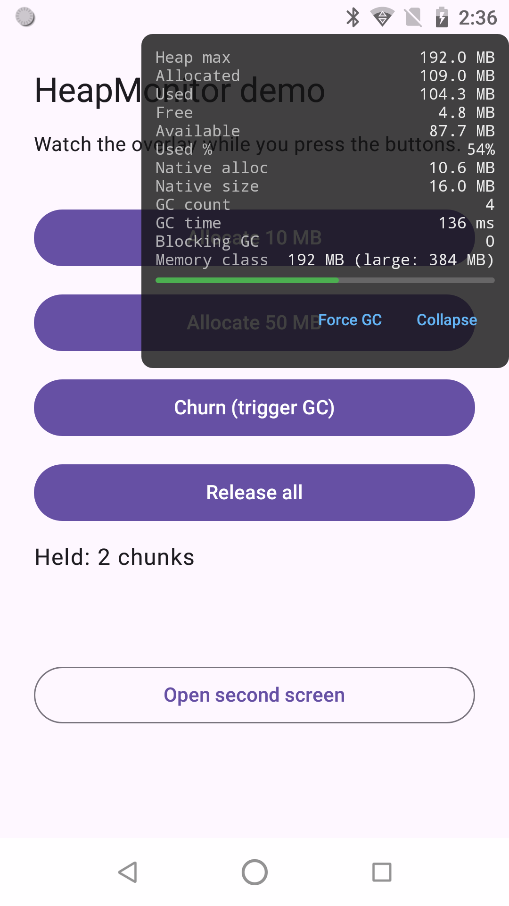

# HeapMonitor

A drop-in Android library that floats a small draggable overlay over every screen of your app,
showing live JVM heap, native heap and garbage-collector counters. Visible only in debuggable
builds; a silent no-op in production.



## What it shows

- **Heap max / allocated / used / free / available** and **used %** with a colored bar
  (green, amber, red at configurable thresholds)
- **Native heap** allocated and total size
- **GC count** with a `(+n)` delta since the previous sample, **GC time**, **blocking GC count**
  (with how many were forced by you) and **blocking GC time**
- **Memory class** (normal and large) and whether `largeHeap` is enabled
- A **Force GC** button that runs `Runtime.gc()` on a background thread and re-samples

The collapsed chip reads like `84.0/200.0 MB · GC 17`; tap it to expand, drag it anywhere.

### Reading "Blocking GC"

ART reports `art.gc.blocking-gc-count` for every collection that an *app* thread started or waited
on, as opposed to the concurrent collections run by its `HeapTaskDaemon`. It does **not** mean the
collector was prevented from running. `Runtime.gc()` always runs synchronously on the calling thread,
so every Force GC press adds one to this counter; the overlay shows that share as `(n forced)`, and
`HeapSnapshot.naturalBlockingGcCount` gives you the rest. A rising natural count without any forced
GCs means allocation pressure is stalling your threads. Blocking GC time is the summed pause.

## Install

Add JitPack to your `settings.gradle.kts`:

```kotlin
dependencyResolutionManagement {
    repositories {
        google()
        mavenCentral()
        maven { url = uri("https://jitpack.io") }
    }
}
```

Then pick one of the two integration styles in your app module:

```kotlin
// simplest: runtime-gated, no-op in non-debuggable builds
implementation("com.github.ifahimkhan.HeapMonitor:heapmonitor:v0.1.1")

// zero-footprint release (LeakCanary style)
debugImplementation("com.github.ifahimkhan.HeapMonitor:heapmonitor:v0.1.1")
releaseImplementation("com.github.ifahimkhan.HeapMonitor:heapmonitor-noop:v0.1.1")
```

## Usage

That's it. HeapMonitor auto-installs via a `ContentProvider` and attaches the overlay to every
`ComponentActivity` in debuggable builds. No code, no permissions, no manifest changes.

### Manual configuration

If you want a custom sample interval, start position or thresholds, remove the auto-installer in
your `AndroidManifest.xml`:

```xml
<manifest xmlns:android="http://schemas.android.com/apk/res/android"
    xmlns:tools="http://schemas.android.com/tools">
    <application>
        <provider
            android:name="com.fahim.heapmonitor.install.HeapMonitorInstaller"
            android:authorities="${applicationId}.heapmonitor-installer"
            tools:node="remove" />
    </application>
</manifest>
```

and install it yourself from `Application.onCreate()`:

```kotlin
class DemoApplication : Application() {
    override fun onCreate() {
        super.onCreate()
        HeapMonitor.install(this, HeapMonitorConfig(sampleIntervalMs = 500, startExpanded = true))
    }
}
```

`HeapMonitor.uninstall()` removes the overlay and stops sampling; `HeapMonitor.snapshots` is a
`StateFlow<HeapSnapshot>` you can collect yourself.

## Compose-only usage

If you prefer to place the overlay yourself (or your screens are not activities the auto-attacher
can reach), drop the composable inside any `Box`. It fills its parent but only the chip or card
consumes touches:

```kotlin
Box(Modifier.fillMaxSize()) {
    AppContent()
    HeapMonitorOverlay(config = HeapMonitorConfig(initialPosition = OverlayPosition.BottomEnd))
}
```

The composable still needs `HeapMonitor.install()` to have run, otherwise it shows empty values.

## Configuration

| Field | Default | Meaning |
|-------|---------|---------|
| `enabled` | `null` | `null` = show only when the app is debuggable; `true` / `false` forces on or off |
| `sampleIntervalMs` | `1000` | How often the heap is read; coerced to at least 100 ms |
| `initialPosition` | `OverlayPosition.TopEnd` | Corner the overlay starts in (`TopStart`, `TopEnd`, `BottomStart`, `BottomEnd`) |
| `startExpanded` | `false` | Show the full card instead of the compact chip on first attach |
| `showForceGcButton` | `true` | Show the Force GC button in the expanded card |
| `warnUsedPercent` | `75` | Used-heap percentage at which the usage colour turns amber |
| `criticalUsedPercent` | `90` | Used-heap percentage at which the usage colour turns red |

## How gating works

On install the library reads `ApplicationInfo.FLAG_DEBUGGABLE`. When the flag is off and
`enabled` is `null`, `install()` returns immediately: nothing is sampled, drawn or logged. Pass
`HeapMonitorConfig(enabled = true)` to force the overlay in a non-debuggable QA build, or
`enabled = false` to hide it in a debug build. For a release APK that contains no monitor code at all,
use the `heapmonitor-noop` artifact as shown above.

Sampling runs only while at least one activity is started, on `Dispatchers.Default`.

## Reading the numbers

- **Max** is `Runtime.maxMemory()`: the hard ceiling for this process before `OutOfMemoryError`.
- **Allocated** is `Runtime.totalMemory()`: what the VM has currently reserved from the system.
- **Used** is allocated minus `Runtime.freeMemory()`: live plus not-yet-collected objects.
- **Free** is the unused part of the allocated block; **Available** is max minus used, the room
  left before the ceiling.
- **GC count / time** come from `Debug.getRuntimeStats()` keys `art.gc.gc-count` and
  `art.gc.gc-time`; blocking GC counters come from `art.gc.blocking-gc-count`. Missing keys read
  as `0` on older or restricted runtimes.
- The library never sets `android:largeHeap`. The memory class line shows what your app would get
  with and without it so you can make that decision consciously.

## Requirements

- minSdk 23
- Jetpack Compose BOM 2024.09.00 or newer in the consuming app
- AGP 8.x or newer for consumers (the library itself is built with AGP 9.0.0, Gradle 9.1, JDK 17)
- No extra permissions; the overlay lives inside the activity window, not on top of other apps

## Development

```bash
./gradlew :heapmonitor:testDebugUnitTest            # JVM tests
./gradlew :heapmonitor:connectedDebugAndroidTest    # Compose UI + attach tests (device needed)
./gradlew :app:installDebug                         # sample app
./gradlew :heapmonitor:publishToMavenLocal :heapmonitor-noop:publishToMavenLocal
```

## License

[MIT](LICENSE)
